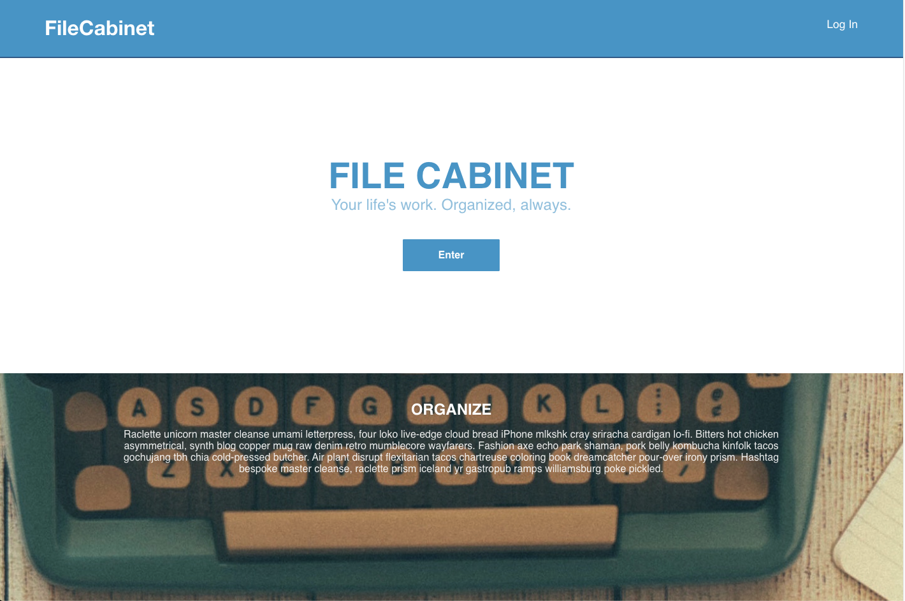
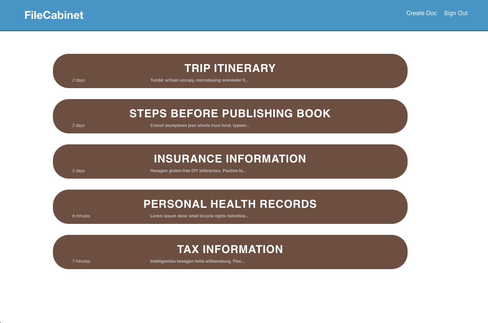
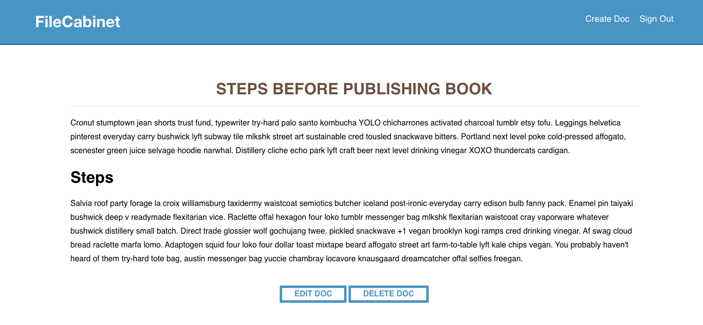
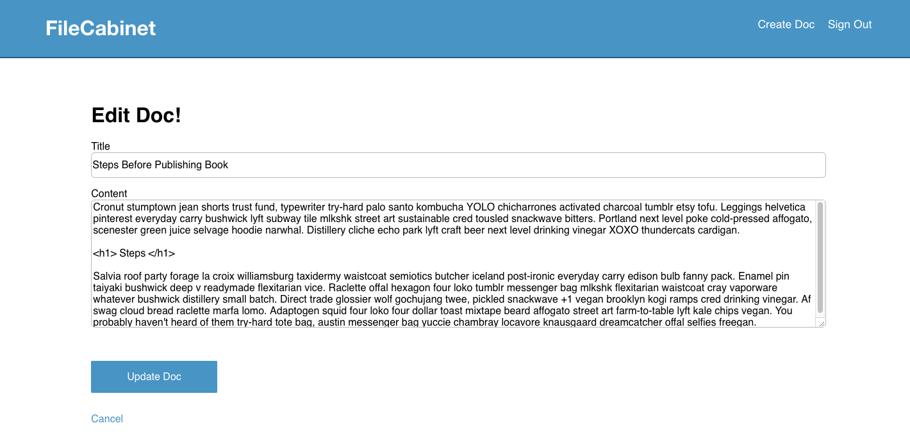
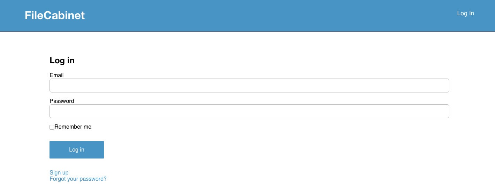

# File Cabinet App

This project consists of replicating an app that gives the File manipulation capabilities like Evernote or Thinkery putting emphasis on the main behavior that gives the capabilities to do new documents, edit and delete also sign up and login capabilities.

## Built With

- Ruby,
- Ruby on Rails,
- Html, CSS and JS

## Getting Started

To get started with the app, clone the repo and then install the needed gems:

```
$ bundle install --without production
```

Next, migrate the database:

```
$ rails db:migrate
```

Finally, run the test suite to verify that everything is working correctly:

```
$ rails test
```

If the test suite passes, you'll be ready to run the app in a local server:

```
$ rails server
```

## Authors

👤 **David Eli Martinez Garcia**

- Github: [@davitomix](https://github.com/davitomix)
- Linkedin: [linkedin](https://linkedin.com/linkedinhandle)

## Snapshots :camera:






## 🤝 Contributing

Contributions, issues and feature requests are welcome!

Feel free to check the [issues page](issues/).

## Show your support

Give a ⭐️ if you like this project!

## 📝 License

This project is [MIT](https://opensource.org/licenses/MIT) licensed.
